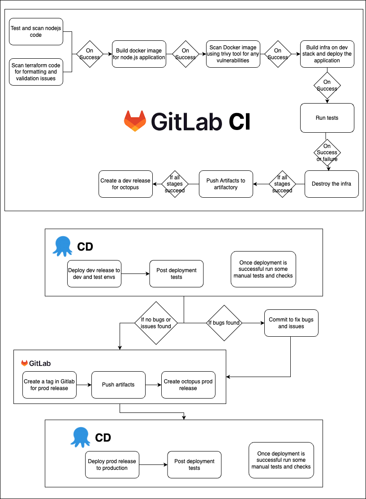

# Deployment of octopus.js app

## Requirement
Deploy octopus.js app  

## Tools and Services used

1. IAC tool - Terraform
2. Cloud - AWS 
3. Application Deployment - EKS (Elastic Kubernetes service)

## Complete CI/CD solution

Please refer this image for the complete solution. 

1. The app is packaged into docker images.
2. Docker images of the app are deployed to AWS EKS cluster.
3. AWS EKS cluster and its related infra is created using terraform.

## How to run the code
1. Build the Dockerfile and push image to ECR repository
 
    > aws ecr get-login-password --region us-east-1 | docker login --username AWS --password-stdin ECR_REPO_PATH

    > docker build -t octopus_app

    > docker tag octopus_app:latest ECR_REPO_PATH

    > docker push ECR_REPO_PATH:latest

2. Create EKS cluster and its related infra 
    > cd infra_code

    > terraform init -backend-config="access_key=access key" -backend-config="secret_key=secret key"

    > terraform plan -var AWS_ACCESS_KEY="<access key>" -var AWS_SECRET_KEY="<secret key>"  

    > terraform apply -var AWS_ACCESS_KEY="<access key>" -var AWS_SECRET_KEY="<secret key>" 

3. Deploy Application on EKS
    > cd k8s_code

    > Update the path of your image in deployments.yaml folder

    > aws configure

    > aws eks update-kubeconfig --region us-east-1 --name dev_octopus_cluster

    > kubectl apply -f deployment.yaml

    > kubectl port-forward deployment/octopus 8080:3000

    Now you will be able to see the application in your browser at localhost:8080/info.